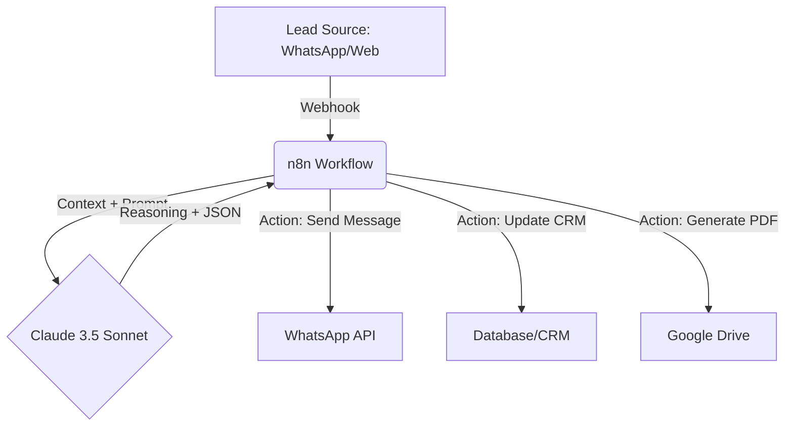

# Technical Architecture: Claude-Native Automation

This document describes the technical high-level architecture of the `n8n-ai-sales-br` project.

---

## 1. The Stack

- **Intelligence Layer:** Claude 3.5 Sonnet (Anthropic API)
- **Workflow Engine:** n8n (Self-hosted or Cloud)
- **Messaging Interface:** Evolution API / Z-API (WhatsApp integration)
- **Data Source:** CRM (Pipedrive/Hubspot) or Google Sheets
- **Deployment:** Docker / DigitalOcean

---

## 2. Information Flow

---

## 3. Why Claude-Native?

Unlike generic automation, this architecture treats the LLM as a **State Machine and Decision Engine**:

1. **Deterministic JSON:** We force Claude to output structural data that n8n can parse without errors.
2. **Context-Rich:** We pass the last 5 interactions of the lead to Claude to maintain conversation "memory".
3. **Multi-Step Reasoning:** A single n8n node call to Claude can simultaneously score a lead, categorize an objection, and draft a response.

---

## 4. Security & Compliance

- **PII Protection:** We recommend masking sensitive data before sending it to the Anthropic API.
- **Audit Log:** Every decision made by Claude is logged in the CRM notes for broker review.
- **Compliance:** Prompts include strict instructions to follow Brazilian BACEN financial regulations.

---

*Powered by [Claude AI](https://claude.ai) + [n8n](https://n8n.io) 💜*
