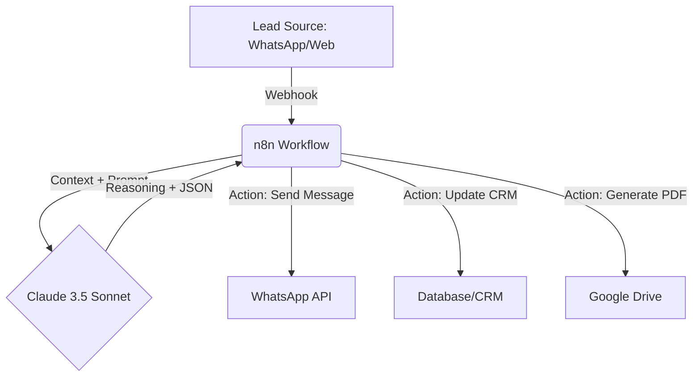
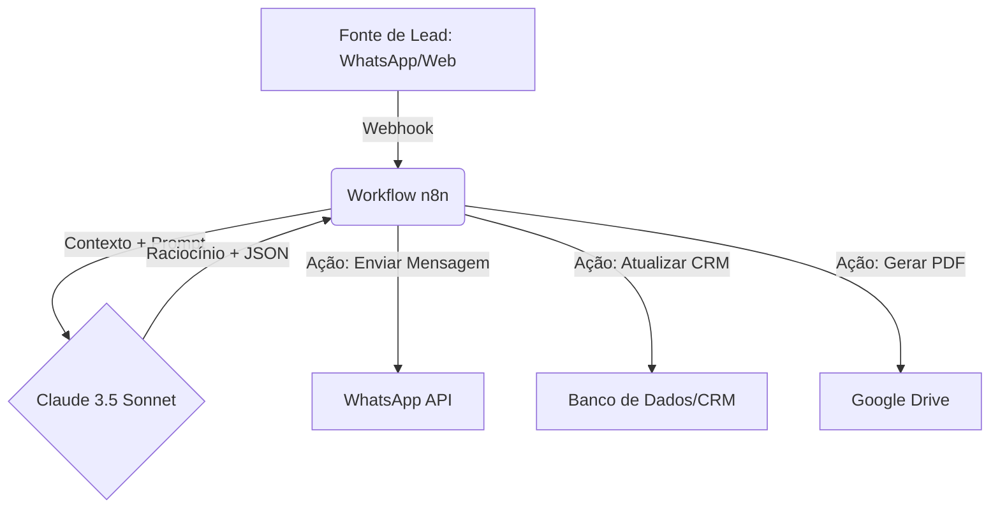

# Technical Architecture: Claude-Native Automation

[English](#english) | [Português](#português)

---

## English Version

This document describes the technical high-level architecture of the `n8n-ai-sales-br` project.

---

### 1. The Stack

- **Intelligence Layer:** Claude 3.5 Sonnet (Anthropic API)
- **Workflow Engine:** n8n (Self-hosted or Cloud)
- **Messaging Interface:** Evolution API / Z-API (WhatsApp integration)
- **Data Source:** CRM (Pipedrive/Hubspot) or Google Sheets
- **Deployment:** Docker / DigitalOcean

---

### 2. Information Flow

---

### 3. Why Claude-Native?

Unlike generic automation, this architecture treats the LLM as a **State Machine and Decision Engine**:

1. **Deterministic JSON:** We force Claude to output structural data that n8n can parse without errors.
2. **Context-Rich:** We pass the last 5 interactions of the lead to Claude to maintain conversation memory.
3. **Multi-Step Reasoning:** A single n8n node call to Claude can simultaneously score a lead, categorize an objection, and draft a response.

---

### 4. Scalability (10,000+ Advisors)

To support 10,000+ users and national-level expansion (Ademicon, Itaú, Porto Seguro), the architecture implements:

- **Autopilot Efficiency:** Workflows are optimized to handle repetitive tasks without human intervention, ensuring zero latency for the advisor.
- **Token Optimization:** Prompts are engineered to minimize token usage while maintaining complex reasoning, critical for high-volume operations.
- **Rate Limit Management:** Implementation of retry logic and queues in n8n to manage Anthropic API limits during peak demand.

---

### 5. Security & Compliance

- **PII Protection:** We recommend masking sensitive data before sending it to the Anthropic API.
- **Audit Log:** Every decision made by Claude is logged in the CRM notes for broker review.

---

## Versão em Português

Este documento descreve a arquitetura técnica de alto nível do projeto `n8n-ai-sales-br`.

---

### 1. A Pilha Tecnológica (Stack)

- **Camada de Inteligência:** Claude 3.5 Sonnet (Anthropic API)
- **Motor de Workflow:** n8n (Self-hosted ou Cloud)
- **Interface de Mensageria:** Evolution API / Z-API (Integração WhatsApp)
- **Fonte de Dados:** CRM (Pipedrive/Hubspot) ou Google Sheets
- **Implantação:** Docker / DigitalOcean

---

### 2. Fluxo de Informação

---

### 3. Por que Claude-Native?

Diferente de automações genéricas, esta arquitetura trata o LLM como uma **Máquina de Estados e Motor de Decisão**:

1. **JSON Determinístico:** Forçamos o Claude a entregar dados estruturados que o n8n pode processar sem erros.
2. **Rico em Contexto:** Passamos as últimas 5 interações do lead para o Claude manter a "memória" da conversa.
3. **Raciocínio Multi-Etapa:** Uma única chamada do n8n para o Claude pode simultaneamente qualificar um lead, categorizar uma objeção e redigir uma resposta.

---

### 4. Escalabilidade (10.000+ Assessores)

Para suportar mais de 10.000 usuários e expansão nacional (Ademicon, Itaú, Porto Seguro), a arquitetura implementa:

- **Eficiência em Autopilot:** Workflows otimizados para executar tarefas repetitivas sem intervenção humana, garantindo latência zero para o assessor.
- **Otimização de Tokens:** Prompts estruturados para minimizar o uso de tokens mantendo o raciocínio complexo, essencial para operações de alto volume.
- **Gestão de Rate Limit:** Implementação de lógica de repetição e filas no n8n para gerenciar os limites da API da Anthropic em picos de demanda.

---

### 5. Segurança e Conformidade

- **Proteção de PII:** Recomendamos a máscara de dados sensíveis antes de enviá-los para a API da Anthropic.
- **Log de Auditoria:** Cada decisão tomada pelo Claude é registrada nas notas do CRM para revisão do corretor.
